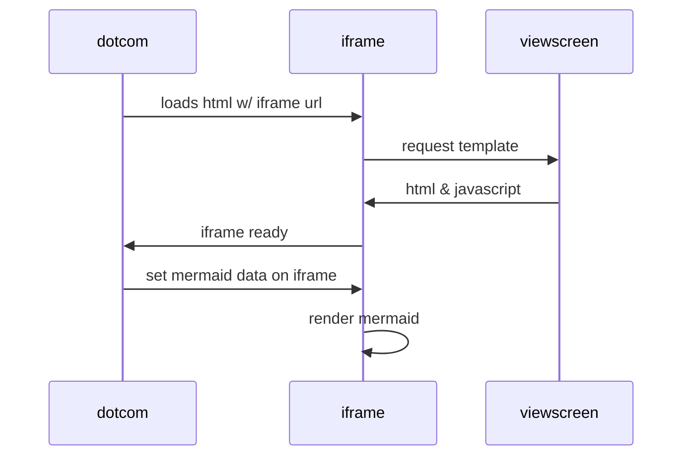

# Test for diagramming in GitBook

This page is a test at the moment, to check out the diagramming ability of GitHub. Copied from https://gist.github.com/martinwoodward/8ad6296118c975510766d80310db71fd 

