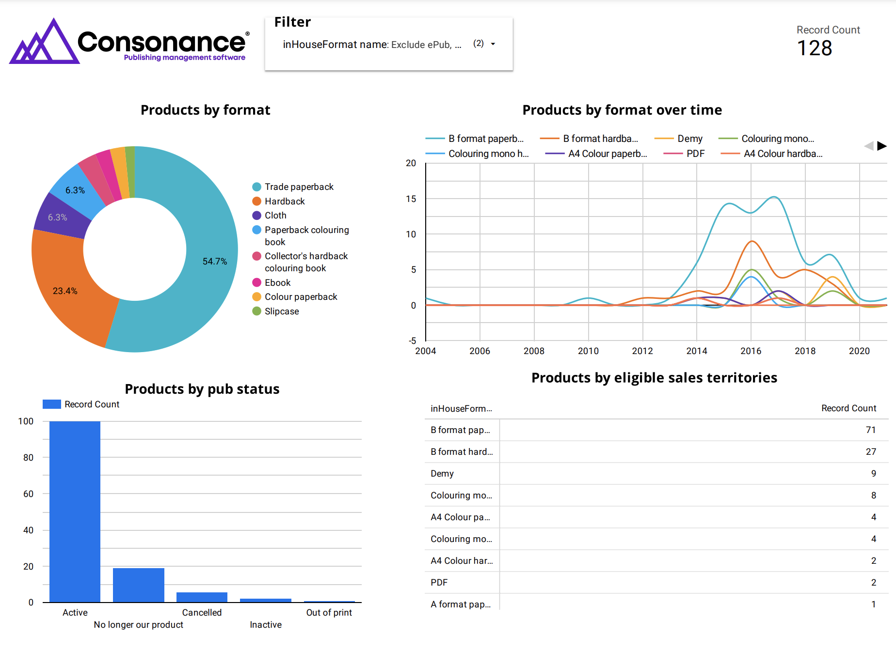

# Sample dashboard

Populate a dashboard of charts and graphs using Google Looker Studio (formerly Google Data Studio)

## Explanation

Using Google Sheets and Google Looker Studio you can populate charts and graphs to create a dashboard of your data.

**Prepare Your Data in Google Sheets:**

* Start by building a [custom report](sample\_custom\_report.md)  in Google Sheets. Include all the fields you need for your dashboard.
* Run this report at least once to ensure your data is up-to-date.

**Set Up Your Report in Looker Studio:**

* Open Looker Studio and create a new report.
* Choose Google Sheets as your data source from the available Google Connectors.

**Connect Your Custom Report:**

* Link the custom report you created in Google Sheets as your data source.
* Select the appropriate spreadsheet from your Google Sheets.
* When prompted with a warning about adding data to your report, select `Add to Report` to proceed.

**Add Charts to Your Dashboard:**

* Utilise the options in the main navigation or sidebar in Looker Studio to add charts.
* Use the fields from your custom report in Google Sheets to populate these charts.

**Refresh Your Data:**

* To update the data in your dashboard, go to `View > Refresh Data` in the main navigation bar.
* Alternatively, you can use the keyboard shortcut `Ctrl+Shift+E` to refresh the data.

Regularly refreshing your data ensures your dashboard reflects the most current information. Experiment with different chart types in Looker Studio to best represent your data.

### Examples

Total products filtered by format, publication status, sales territories or publication date

