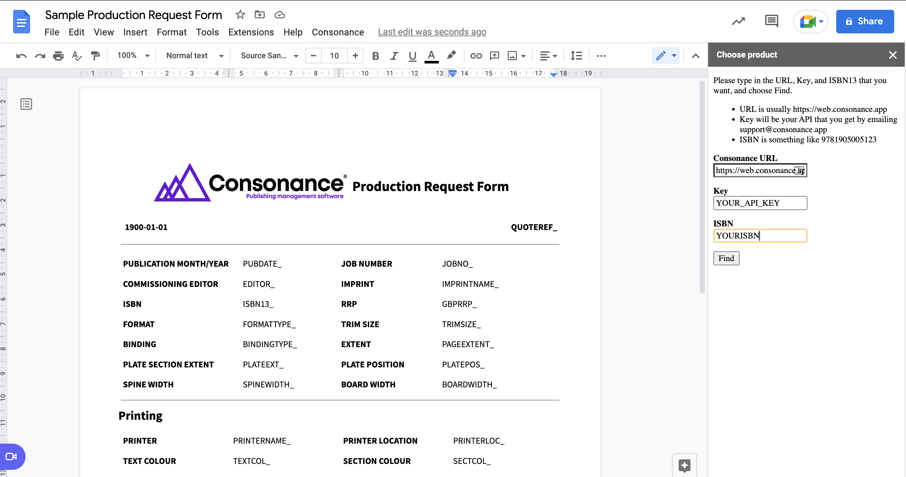
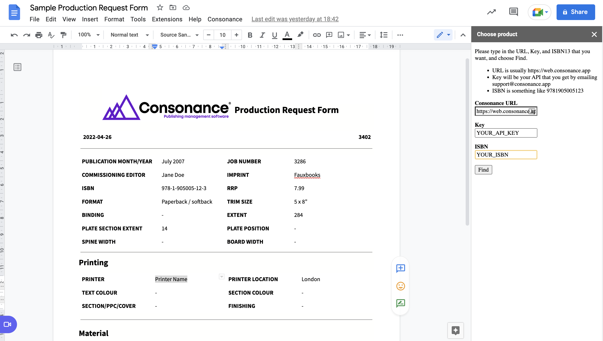

# Sample production request form

Generate a production request form for a particular product using Google Docs

## Explanation

Using a combination of GraphQL and Javascript in Google Docs and Apps Script you can populate fields for a production request form using fields that retrieve Work and Product level information. Note that some of these fields will require a production run to exist in Consonance in order to populate.

**Setting Up the Sidebar in Google Docs:**

* Open a new Google Docs document.
* Navigate to `Extensions > Apps Script`.
* In the Apps Script Editor, click the plus icon (+) next to "Files" and create a new HTML file named 'sidebar'.
* Copy and paste the HTML code below to create an interactive sidebar, replacing any placeholder text that already exists in the new file. This sidebar, accessible from the main navigation of your document, includes a form for inputting an ISBN, URL, and API key. The sidebar can be customised with CSS.

```
<!DOCTYPE html>
<html>
  <head>
    <base target="_top">
        <!--link href='https://fonts.googleapis.com/css?family=Open+Sans:400,600,300' rel='stylesheet' type='text/css'-->
    <link href='open-sans.css' rel='stylesheet' type='text/css'>
    <style type="text/css">
        * {
            font-family: 'Open Sans';
            font-style: normal;
            font-size: 13px;
        }
        .light { 
            font-weight: 300;
        }
        .regular { 
            font-weight: 400;
        }
        .semibold { 
            font-weight: 600;
        }
    </style>
  </head>
  <body>
    <p>
      Please type in the URL, Key, and ISBN13 that you want, and choose Find.
    <ul>
      <li>URL is usually https://web.consonance.app</li>
      <li>Key will be your API that you get by emailing support@consonance.app</li>
      <li>ISBN is something like 9781905005123</li>
    </ul>
    </p>
    <form id="isbnGetter">
      <p class="semibold">
        <label>Consonance URL</label>
        <br />
        <input type="text" value="https://web.consonance.app" id="url" name="url">
      </p>
      <p class="semibold">
        <label>Key</label>
        <br/>
        <input type="text" value="" id="key" name="key">
      </p>
      <p class="semibold">
        <label>ISBN</label>
        <br/>
        <input type="text" value="" id="isbn13" name="isbn13">
       </p>
      <input type="button" value="Find" onclick="google.script.run.main(isbnGetter)">
    </form>
  </body>
</html>
```

**Creating the Main Script:**

* In the Script Editor, select `Code.gs` from the file section. Google might have called it something else, but there will only be one file with the .gs extension, so that's the one to select.
* Copy and paste the JavaScript code below into this file. This code includes functions for opening the sidebar, sending GraphQL queries, and populating your Google Doc with the fetched data.
* Optionally, replace placeholders like `YOUR_API_KEY` with actual values provided by Consonance support.

```
function onOpen() {
  DocumentApp.getUi()
    .createMenu('Consonance')
    .addItem('Show sidebar', 'showSidebar')
    .addToUi();
}

function showSidebar() {
  const html = HtmlService.createHtmlOutputFromFile('sidebar')
    .setTitle('Choose product');
  DocumentApp.getUi()
    .showSidebar(html)
}

function queryResponse(isbn, key, url) {
  const queryString = `
    query {
      product(productSearch: {isbn13Eq: "${isbn}"}) {
        id
        fullTitle
        subtitle
        publicationDate
        publicationDateString: publicationDateString(directives: "%B %Y")
        plannedPublicationDate
        isbn {isbn10 isbn13 isbnWithDashes}
        gbp_consumer_price: prices(priceSearch:{currencyCodeIn: [GBP], onixPriceTypeCodeIn: [_02], onixPriceTypeQualifierCodeIn: [_05]}) {
          amount
        }
      onix21ProductForm{ code description notes isDeprecated}
      onix21ProductFormCode
        inHouseEdition{
          name
          code
          inHouseFormats {code}
        }
        ... on PhysicalBookProduct {
                productHeightMm: productHeight
                productWidthMm: productWidth
                productHeightCm: productHeight(unit: CM)
                productWidthCm: productWidth(unit: CM)
                productHeightIn: productHeight(unit: IN)
                productWidthIn: productWidth(unit: IN)
                approximatePageCount
                productionPageCount
                mainContentPageCount
                frontMatterPageCount
                backMatterPageCount
                totalNumberedPages
                contentPageCount
                totalUnnumberedInsertPageCount
                wordCount
              }
        work {
          contributorPrettyList
          editionNumber
          imprint {
          id 
          name
          }
productionRuns {
        id
        name
        deliveryDate
        quantities {
          id
          name
          description
          quantity
          receivedQuantity
          productId
        }
        bindings {
          id
          widthOfBoard
          pageBindingMethod
          trimmingMethod
          endpapers
          caseSpineStyle
          description
          bindingInstructions
          productIds
          products {
            id
          }
        }
        covers {
          id
          paper
          coverType
          coverColoursOutside
          coverColoursOutsideDescription
          coverNotes
          productIds
          products {
            id
          }
        }
        embellishments {
          id
          name
          description
          productIds
          products {
            id
          }
        }
        finishes {
          id
          name
          description
          productIds
          products {
            id
          }
        }
        interiors {
          id
          paper
          textColour
          textColourDescription
          textPrintInstructions
          fsc
          productIds
          products {
            id
          }
        }
      }


          mainBicCode: subjectCodes(schemesIn: [BIC], mainOnly: true) {
         code
         description
        }
          mainThema: subjectCodes(schemesIn: [THEMA], mainOnly: true) {
            code
            description
           ... on Thema {
            parentCode
            }
          }
          mainBisac: subjectCodes(schemesIn: [BISAC], mainOnly: true) {
            code
            description
          }
        }
      }
    }
  ` 
  const payload = JSON.stringify({query: queryString})
  const response = UrlFetchApp.fetch(`${url}/graphql`, {
    method: "POST",
    headers: {
      "Content-Type": "application/json",
      authorization: `Bearer ${key}`,
    },
    payload: payload,
  });
  const stringResponse = response.getContentText()
  return JSON.parse(stringResponse)
}
// This sets default values if "form" is not there - i.e. if you're running this from the script editor
const main = (form = {isbn13:"YOUR_ISBN", key:"YOUR_API_KEY", url:"https://web.consonance.app"}) => {
  const doc = DocumentApp.getActiveDocument()
  const body = doc.getBody();
  const product = queryResponse(form.isbn13, form.key, form.url).data.product
  // Looks for a YYYY-MM-DD date pattern and replaces with today's date
  const today = Utilities.formatDate(new Date(), "GMT", "yyyy-MM-dd");
  const pattern = "\\d{2,4}-\\d{1,2}-\\d{1,2}";
  const todayDate = DocumentApp.getActiveDocument().getBody();
  body.editAsText().replaceText(pattern, today);

  body.replaceText("^.*QUOTEREF_*$", product.id || "-");
  body.replaceText("^.*ISBN13_*$", product.isbn.isbnWithDashes || "-");
  body.replaceText("^.*PUBDATE_*$", product.publicationDateString || "-");
  body.replaceText("^.*PUBDATE_*$", product.publicationDateString || "-");
  body.replaceText("^.*JOBNO_*$", product.work.productionRuns[0]?.id || "-");
  body.replaceText("^.*IMPRINTNAME_*$", product.work.imprint.name || "-");
  body.replaceText("^.*GBPRRP_*$", product.gbp_consumer_price[0]?.amount || "-");
  body.replaceText("^.*FORMATTYPE_*$", product.onix21ProductForm.description || "-");
  body.replaceText("^.*TRIMSIZE_*$", product.work.productionRuns[0]?.bindings[0]?.trimmingMethod || "-");
  body.replaceText("^.*BINDINGTYPE_*$", product.work.productionRuns[0]?.bindings[0]?.description || "-");
  body.replaceText("^.*PAGEEXTENT_*", product.productionPageCount || "-");
  body.replaceText("^.*PLATEEXT_*", product.totalUnnumberedInsertPageCount || "-");
  body.replaceText("^.*PLATEPOS_*", product.work.productionRuns[0]?.bindings[0]?.endpapers || "-");
  body.replaceText("^.*SPINEWIDTH_*", product.work.productionRuns[0]?.bindings[0]?.caseSpineStyle || "-");
  body.replaceText("^.*BOARDWIDTH_*", product.work.productionRuns[0]?.bindings[0]?.widthOfBoard || "-");
  body.replaceText("^.*TEXTCOL_*", product.work.productionRuns[0]?.interiors[0]?.textColour || "-");
  body.replaceText("^.*SECTCOL_*", product.work.productionRuns[0]?.interiors[0]?.textColourDescription || "-");
  body.replaceText("^.*SECTCOVER_*", product.work.productionRuns[0]?.covers[0]?.coverType || "-");
  body.replaceText("^.*PRINTFINISH_*", product.work.productionRuns[0]?.finishes[0]?.description || "-");
  body.replaceText("^.*TEXTPAPER_*", product.work.productionRuns[0]?.interiors[0]?.paper || "-");
  body.replaceText("^.*SECTPAPER_*", product.work.productionRuns[0]?.interiors[0]?.paper || "-");
  body.replaceText("^.*JACKETMAT_*", product.work.productionRuns[0]?.covers[0]?.paper || "-");
  body.replaceText("^.*CLOTHCOL_*", product.work.productionRuns[0]?.covers[0]?.coverColoursOutside || "-");
  body.replaceText("^.*ENDPAPERMAT_*", product.work.productionRuns[0]?.bindings[0]?.endpapers || "-");
  body.replaceText("^.*MATEXTRAS_*", product.work.productionRuns[0]?.embellishments[0]?.description || "-");
  body.replaceText("^.*EXPDELIVERY_*", product.plannedPublicationDate || "-");
  body.replaceText("^.*DELQUANTITY_*", product.work.productionRuns[0]?.quantities[0]?.receivedQuantity || "-");
}


```

Save the file. The top of the page should look like this, with onOpen selected:&#x20;

<figure><figcaption></figcaption></figure>

**Creating a template:**

Type and format words as you'd usually do into the doc (not the script).  The words that can be swapped out using the example we've given here are the ones in red in this screenshot:&#x20;

e.g. type IMPRINTNAME\_ into your doc to have it replaced with the imprint's name.

You can edit the script if you prefer different names, and add other queries.&#x20;


**Using Your Custom Production Request Form:**

* Back in your Google Docs document, a new menu item "Consonance" will appear in the main navigation bar.
* Click on it and select the option to open the sidebar.
* Fill out the form in the sidebar with the required information (URL, API Key, ISBN) and click "Find" to auto-populate the production request form.

Here is an example of how your Google doc might look before the script runs.



This is how it might look after choosing the 'Find' button.



**Troubleshooting**

If you are signed in to more than one Google account, this can apparently mess things up, so try signing out of all but one account if the Find button doesn't change anything.

You'll probably be prompted to authenticate: click OK on dialogue boxes that prompt you.&#x20;

Raise a support ticket to get your API key at support@consonance.app.&#x20;

Raise a ticket if you'd like us to share a starter template with you.&#x20;
